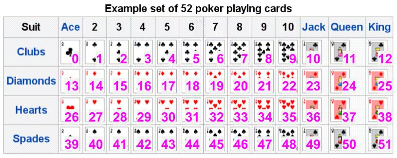

# Lab 11: Card Game with C++ Classes (Part 1 of 3)


### Learner Objectives
At the conclusion of this lab assignment, participants should be able to:
* Define, implement and use a class 

### Acknowledgements
Content used in this assignment is based upon information in the following sources:
* This program is a modified version of a student homework for CptS 122 at WSU by Dr. John Schneider.


## Part I - Card class

### Task 1
The focus of today's lab is to write the `Card` class. How can we represent a card as a C++ object? This lab will also require you to create two other files besides your **main.cpp**.

1. Create three files.
    - [ ] `main.cpp` - Client code
    - [ ] `card.cpp` - Class implementation file
    - [ ] `card.h` - Class declaration/interface file
    
2. **Carefully read the comments in the codes** below as it will guide you to what code needs to be written.

#### card.h
This header file will hold the `Card` class declaration.
- [ ] Make sure you have a file header comment.
- [ ] Ensure that you use the guard code. 
- [ ] Inside the guard code, copy the code below which includes the include statements and global constant variables you will need to finish this lab
- [ ] Just below the global constant, write the code to create a class called `Card`
    - [ ] The `Card` class will have the following member functions and variable
        * `void setValue(int value)` - sets the numeric card value
        * `void setValue(int suit, int rank)` - sets the numeric card value based on suit and rank
        * `int getValue()` - returns the numeric card value
        * `void print()` - prints the card value as (e.g. "Jack of Hearts", "Ace of Diamond", etc.)
        * `int mCardValue` - holds the card's value (0 to 51)

```cpp
#include <iostream>
#include <string>
using namespace std;

// Source: https://en.wikipedia.org/wiki/Standard_52-card_deck
const int NUM_RANKS = 13;
const int NUM_SUITS = 4;
const string RANKS[] = {"Ace", "Two", "Three", "Four", "Five", 
                        "Six", "Seven", "Eight", "Nine", "Ten",
                        "Jack", "Queen", "King"};
const string SUITS[] = {"Clubs", "Diamonds", "Hearts", "Spades"};
```

#### card.cpp
The `card.cpp` file is where you will write the class implementation code for the `Card` member functions. 
- [ ] Make sure you have a file header comment.
- [ ] Make sure that at the top of this file, you include `card.h`
- [ ] Make sure that each function has a function header comment.

- [ ] Implement `getValue()`.
- [ ] Implement `setValue(int value)`. 
- [ ] Implement `setValue(int suit, int rank)`. 
- [ ] Implement `print()`. 

```cpp
// Code implementation of the Card member functions goes here

// int getValue() --- Get card value
// - return the value of the mCardValue member variable

// void setValue(int value) --- Set card value (0 to 51). Check to make sure value is valid. If invalid, set value to -1.
// - set the value of the mCardValue member variable

// void setValue(int suit, int rank) --- Set card value (0 to 51). But you have to convert the value of suit and rank to 0 to 51.
//                                       Check to make sure the value of suit and rank are valid values suit (0 to 3) and rank (0 to 12)
// - set the value of the mCardValue member variable

// void print() --- Print card value
// IMPORTANT NOTE: The card's value can be between 0 and 51 (since there are 52 cards in the standard deck). 
//                 If the card value is -1, print to the screen "Joker\n"
// 1. We can determine the rank for the card by taking the card's value modulo by NUM_RANKS. That yields a result between 0 and 12, where
//    0 - means a rank of Ace, 
//    1-9 - means a rank value of 2 to 10 respectively, and 
//    10, 11, 12 has a rank value of Jack, Queen, King respectively.
// 2. We can determine the suit by taking the card's value and dividing by a NUM_RANKS (which yields a result between 0 and 3).
//
// Example: if the card's value is 0, the print member function should print
//    Ace of Clubs
```



#### main.cpp
The `main.cpp` file is where you will test your `Card` class. 
- [ ] Make sure you have a file header comment.
- [ ] Must include `card.h`
- [ ] Write the program for `main()` using the comments and make sure output of the program is exactly the same as the **Sample Run** below.
- [ ] Fix all bugs, then present work to instructor.
- [ ] Commit code with message `"Task 1 completed"`. Proceed to **Task 2**.
```cpp
#include <iostream>

using namespace std;

int main()
{
    // loop 52 times to print out all cards in a standard deck
    //     Create an instance of the Card class
    //     set the card object to the counter by calling the appropriate Card member function
    //     print the card by calling the appropriate Card member function

    return 0;
}
```

### Sample Run
```
Ace of Clubs
Two of Clubs
Three of Clubs
Four of Clubs
Five of Clubs
Six of Clubs
Seven of Clubs
Eight of Clubs
Nine of Clubs
Ten of Clubs
Jack of Clubs
Queen of Clubs
King of Clubs
Ace of Diamonds
Two of Diamonds
Three of Diamonds
Four of Diamonds
Five of Diamonds
Six of Diamonds
Seven of Diamonds
Eight of Diamonds
Nine of Diamonds
Ten of Diamonds
Jack of Diamonds
Queen of Diamonds
King of Diamonds
Ace of Hearts
Two of Hearts
Three of Hearts
Four of Hearts
Five of Hearts
Six of Hearts
Seven of Hearts
Eight of Hearts
Nine of Hearts
Ten of Hearts
Jack of Hearts
Queen of Hearts
King of Hearts
Ace of Spades
Two of Spades
Three of Spades
Four of Spades
Five of Spades
Six of Spades
Seven of Spades
Eight of Spades
Nine of Spades
Ten of Spades
Jack of Spades
Queen of Spades
King of Spades
```

### Task 2
Add more functionality to the `Card` class by adding two more getter functions. The code that will go inside this two functions can be taken from `print()`.
- [ ] Create a `getRank()` accessor ("getter") function that returns the card's rank value as a `string`. Commit code once completed.
    * **Note**: If the value of the card is `-1`, return `"Joker"`. This should be first thing you do inside this function. **Why?**
- [ ] Create a `getSuit()` accessor ("getter") function that returns the card's suit value as a `string`. Commit code once completed.
    * **Note**: If the value of the card is `-1`, return `"Joker"`. This should be first thing you do inside this function. **Why?**

Once you complete the two functions.
- [ ] Update the `print()` function to call the `getRank()` and `getSuit()` functions.
- [ ] Fix all bugs. Commit code with message `"Task 2 completed"`. Proceed to **Task 3**.


## Task 3 
- [ ] Create a constructor for the `Card` class which sets the card's value to -1. 
- [ ] Turn all the accessor (e.g. getter) functions into constant functions by adding `const` keyword at the end of the function headers in both function prototypes and function definitions.
- [ ] Verify with instructor that code is correctly done.
- [ ] Commit code with message `"Task 3 completed"`.
- [ ] Present work to instructor.
- [ ] Submit Github URL to Canvas.

## Submitting Assignments
* It is VERY IMPORTANT that besides pushing the code to GitHub that you still submit the GitHub URL of this lab assignment in Canvas. This allows the instructor to be notified of your final submission.

> **_NOTE: By submitting your code to be graded, you are stating that your submission does not violate the Academic Integrity Policy outlined in the syllabus._**

